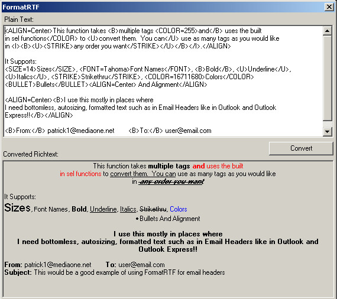



## FormatRTF Richtext Formatting Function

### Description

This function takes tag delimited text and converts it for display in a richtext box. Great for email headers (from, to, subject lines). Someone Rank this Thing...Enjoy!!
 
### More Info
 

             |
---                |---
**Submitted On**   |2001-06-18 13:10:30
**By**             |[Patrick Daniel](https://github.com/Planet-Source-Code/PSCIndex/blob/master/ByAuthor/patrick-daniel.md)
**Level**          |Advanced
**User Rating**    |5.0 (30 globes from 6 users)
**Compatibility**  |VB 4\.0 \(32\-bit\), VB 5\.0, VB 6\.0
**Category**       |[String Manipulation](https://github.com/Planet-Source-Code/PSCIndex/blob/master/ByCategory/string-manipulation__1-5.md)
**World**          |[Visual Basic](https://github.com/Planet-Source-Code/PSCIndex/blob/master/ByWorld/visual-basic.md)
**Archive File**   |[FormatRTF 213286182001\.zip](https://github.com/Planet-Source-Code/patrick-daniel-formatrtf-richtext-formatting-function__1-24195/archive/master.zip)

